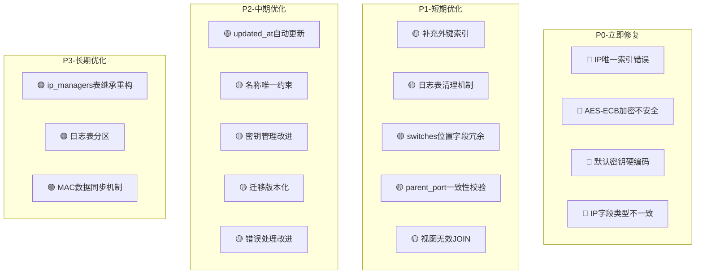

# IPMA 数据库架构优化分析报告

**版本：** 1.0.0  
**分析日期：** 2026-04-13  
**分析范围：** 全部25张数据表 + 视图 + 触发器 + 索引  
**源文件：** [schema.rs](file:///root/ipma/src/init/schema.rs)

---

## 目录

1. [总体评价](#总体评价)
2. [严重问题（必须修复）](#严重问题必须修复)
3. [架构设计问题（建议优化）](#架构设计问题建议优化)
4. [索引优化建议](#索引优化建议)
5. [性能优化建议](#性能优化建议)
6. [安全性问题](#安全性问题)
7. [数据一致性问题](#数据一致性问题)
8. [运维与可维护性](#运维与可维护性)
9. [优化优先级总览](#优化优先级总览)

---

## 总体评价

| 维度 | 评分 | 说明 |
|------|------|------|
| 表结构设计 | ⭐⭐⭐ | 基本合理，但存在冗余和不一致 |
| 索引覆盖 | ⭐⭐ | 关键JOIN字段缺少索引，存在冗余索引 |
| 数据一致性 | ⭐⭐ | 部分CHECK约束不完整，缺少级联保护 |
| 安全性 | ⭐ | 加密方案存在严重缺陷 |
| 性能 | ⭐⭐ | 视图过重，日志表无清理机制 |
| 可维护性 | ⭐⭐⭐ | 迁移逻辑内联，缺少版本化管理 |

---

## 严重问题（必须修复）

### 🔴 问题1：`idx_ip_managers_ip_unique` 唯一索引与业务逻辑冲突

**位置：** [schema.rs:527](file:///root/ipma/src/init/schema.rs#L527)

```sql
CREATE UNIQUE INDEX IF NOT EXISTS idx_ip_managers_ip_unique ON ip_managers(ip_address);
```

**问题描述：** 该索引强制IP地址全局唯一，但业务代码中检查的是**同一网络内**IP唯一性：

```rust
// ip.rs 中的检查逻辑
"SELECT id FROM ip_managers WHERE ip_address = CAST($1 AS INET) AND network_id = $2"
```

**影响：** 不同网络中完全可以存在相同的私有IP（如 `192.168.1.100` 同时出现在多个VLAN中），该唯一索引会阻止这种合法场景。

**修复方案：**
```sql
-- 删除错误的唯一索引
DROP INDEX IF EXISTS idx_ip_managers_ip_unique;

-- 创建正确的复合唯一索引
CREATE UNIQUE INDEX IF NOT EXISTS idx_ip_managers_ip_network_unique 
    ON ip_managers(ip_address, network_id);
```

---

### 🔴 问题2：AES-ECB加密模式不安全

**位置：** [schema.rs:830-860](file:///root/ipma/src/init/schema.rs#L830)

**问题描述：** `encrypt_password()` 和 `decrypt_password()` 函数使用 `AES-ECB` 模式：

```sql
v_encrypted := encrypt(v_padded, v_key, 'aes-ecb/pad:none');
v_decrypted := decrypt(v_ciphertext, v_key, 'aes-ecb/pad:none');
```

**影响：**
- ECB模式对相同明文产生相同密文，无法提供语义安全性
- 攻击者可通过密文模式推断明文结构
- 不符合任何现代安全标准（PCI-DSS、NIST等均禁止ECB）

**修复方案：**
```sql
-- 改用AES-CBC模式 + 随机IV
CREATE OR REPLACE FUNCTION encrypt_password(p_password TEXT)
RETURNS TEXT AS $$
DECLARE
    v_key BYTEA;
    v_iv BYTEA;
    v_encrypted BYTEA;
BEGIN
    IF p_password IS NULL OR p_password = '' THEN
        RETURN p_password;
    END IF;
    
    SELECT decode(encryption_key, 'base64') INTO v_key 
    FROM encryption_keys WHERE key_name = 'system_configs_key';
    
    -- 生成随机IV
    v_iv := gen_random_bytes(16);
    
    v_encrypted := encrypt(p_password::BYTEA, v_key, 'aes-cbc/pad:pkcs', v_iv);
    
    -- 返回 IV + 密文（Base64编码）
    RETURN encode(v_iv || v_encrypted, 'base64');
END;
$$ LANGUAGE plpgsql STRICT;
```

---

### 🔴 问题3：默认加密密钥硬编码

**位置：** [schema.rs:810-815](file:///root/ipma/src/init/schema.rs#L810)

```rust
"AAAAAAAAAAAAAAAAAAAAAAAAAAAAAAAAAAAAAAAAAAA=".to_string()
```

**问题描述：** 当密钥文件不存在时使用全零默认密钥，等于没有加密。

**修复方案：** 应在启动时检测并拒绝使用默认密钥，而非静默降级。

---

### 🔴 问题4：`switch_macs.ip_address` 类型与 `ip_managers.ip_address` 不一致

**位置：** [schema.rs](file:///root/ipma/src/init/schema.rs)

| 表 | 字段 | 类型 |
|---|---|---|
| ip_managers | ip_address | INET |
| switch_macs | ip_address | VARCHAR(45) |
| mac_history | ip_address | INET |

**问题描述：** `switch_macs` 使用 `VARCHAR(45)` 存储IP地址，而 `ip_managers` 和 `mac_history` 使用 `INET` 类型。这导致：
- 无法使用PostgreSQL原生IP操作符进行跨表查询
- 无法做IP范围查询
- 数据校验不一致（VARCHAR可存入非法IP）

**修复方案：**
```sql
ALTER TABLE switch_macs ALTER COLUMN ip_address TYPE INET USING ip_address::INET;
```

---

## 架构设计问题（建议优化）

### 🟡 问题5：`switches` 表中 `cabinet_id/start_u/end_u` 与 `positions` 表数据冗余

**位置：** [schema.rs:600-625](file:///root/ipma/src/init/schema.rs#L600)

**问题描述：** 交换机的机柜位置信息同时存在于两处：
1. `switches.cabinet_id` / `switches.start_u` / `switches.end_u`（迁移后新增）
2. 通过 `ip_managers(position_id)` → `positions(cabinet_id, start_u, end_u)` 间接关联

**影响：**
- 数据冗余，更新时需同步两处
- 可能出现数据不一致
- 违反数据库范式（第三范式）

**修复方案（二选一）：**

**方案A：移除 switches 上的冗余字段**（推荐）
```sql
-- 通过 ip_managers + positions 获取交换机位置信息
-- 在 switches_with_details 视图中JOIN获取
ALTER TABLE switches DROP COLUMN cabinet_id;
ALTER TABLE switches DROP COLUMN start_u;
ALTER TABLE switches DROP COLUMN end_u;
```

**方案B：保留但添加一致性触发器**
```sql
-- 当 switches 的位置字段更新时，同步更新关联的 position
-- 或反向同步
```

---

### 🟡 问题6：`ip_managers` 表的多态关联设计

**位置：** [schema.rs](file:///root/ipma/src/init/schema.rs)

**问题描述：** `ip_managers` 使用4个可空外键（`workstation_id`, `position_id`, `switch_id`, `switch_port_id`）实现多态关联，配合复杂的CHECK约束：

```sql
CONSTRAINT chk_device_consistency CHECK (
    (device_type = 'switch' AND switch_id IS NOT NULL AND workstation_id IS NULL) OR
    (device_type = 'workstation' AND workstation_id IS NOT NULL AND position_id IS NULL AND switch_id IS NULL) OR
    (device_type = 'cabinet_position' AND position_id IS NOT NULL AND workstation_id IS NULL AND switch_id IS NULL) OR
    (device_type = 'unknown')
)
```

**影响：**
- 每行只有1-2个FK字段有值，其余为NULL，空间浪费
- CHECK约束复杂，维护成本高
- 添加新设备类型需修改约束
- `switch_port_id` 不在约束中，语义不明确

**修复方案（长期）：** 考虑使用表继承或分区表：

```sql
-- 基础表
CREATE TABLE ip_managers_base (
    id UUID PRIMARY KEY DEFAULT uuid_generate_v4(),
    network_id UUID NOT NULL REFERENCES network_cidrs(id),
    ip_address INET NOT NULL,
    ip_version SMALLINT NOT NULL DEFAULT 4,
    mac_address VARCHAR(20),
    hostname VARCHAR(100),
    status VARCHAR(20) NOT NULL DEFAULT 'active',
    last_seen TIMESTAMP WITH TIME ZONE NOT NULL DEFAULT NOW(),
    created_at TIMESTAMP WITH TIME ZONE NOT NULL DEFAULT NOW(),
    updated_at TIMESTAMP WITH TIME ZONE NOT NULL DEFAULT NOW()
);

-- 工作站IP
CREATE TABLE ip_managers_workstation (
    workstation_id UUID NOT NULL REFERENCES workstations(id) ON DELETE SET NULL
) INHERITS (ip_managers_base);

-- 机柜位置IP
CREATE TABLE ip_managers_position (
    position_id UUID NOT NULL REFERENCES positions(id) ON DELETE SET NULL
) INHERITS (ip_managers_base);

-- 交换机IP
CREATE TABLE ip_managers_switch (
    switch_id UUID NOT NULL REFERENCES switches(id) ON DELETE SET NULL,
    switch_port_id UUID REFERENCES switch_ports(id) ON DELETE SET NULL
) INHERITS (ip_managers_base);
```

> ⚠️ 注意：此方案为长期优化建议，涉及大量代码改动，需评估投入产出比。当前多态关联方案在设备类型较少时仍可接受。

---

### 🟡 问题7：`switches.parent_port_id` 缺少跨表一致性校验

**位置：** [schema.rs](file:///root/ipma/src/init/schema.rs)

**问题描述：** `switches.parent_port_id` 引用 `switch_ports(id)`，但没有约束确保该端口属于 `parent_switch_id` 对应的交换机。

**影响：** 可能出现 parent_port_id 指向非 parent_switch_id 交换机的端口，造成数据逻辑错误。

**修复方案：** 添加触发器校验：

```sql
CREATE OR REPLACE FUNCTION check_parent_port_consistency() RETURNS TRIGGER AS $$
BEGIN
    IF NEW.parent_switch_id IS NOT NULL AND NEW.parent_port_id IS NOT NULL THEN
        IF NOT EXISTS (
            SELECT 1 FROM switch_ports 
            WHERE id = NEW.parent_port_id AND switch_id = NEW.parent_switch_id
        ) THEN
            RAISE EXCEPTION '上级端口必须属于上级交换机';
        END IF;
    END IF;
    RETURN NEW;
END;
$$ LANGUAGE plpgsql;

CREATE TRIGGER trg_check_parent_port_consistency 
    BEFORE INSERT OR UPDATE OF parent_switch_id, parent_port_id ON switches 
    FOR EACH ROW EXECUTE FUNCTION check_parent_port_consistency();
```

---

### 🟡 问题8：`ip_managers.switch_port_id` 语义不明确

**问题描述：** `ip_managers` 表同时有 `switch_port_id` 字段，而 `position_ports` 和 `workstation_ports` 也记录了端口关联。当 `device_type = 'cabinet_position'` 时，端口关联应通过 `position_ports` 获取，而非直接存在 `ip_managers` 上。

**影响：** 端口关联数据可能存在两份（`ip_managers.switch_port_id` 和 `position_ports`/`workstation_ports`），造成不一致。

**修复方案：** 明确 `ip_managers.switch_port_id` 的使用场景，或在CHECK约束中加入该字段的规则。

---

## 索引优化建议

### 🔴 问题9：重复索引

**位置：** [schema.rs:519-525](file:///root/ipma/src/init/schema.rs#L519)

```sql
-- 以下两个索引功能重叠：
"CREATE INDEX IF NOT EXISTS idx_ip_managers_switch_id ON ip_managers(switch_id) WHERE device_type = 'switch'",
-- ... 
"CREATE INDEX IF NOT EXISTS idx_ip_managers_switch_id ON ip_managers(switch_id)",
"CREATE INDEX IF NOT EXISTS idx_ip_managers_switch_device ON ip_managers(switch_id, device_type)",
```

**修复方案：**
```sql
-- 保留复合索引即可覆盖单列查询
DROP INDEX IF EXISTS idx_ip_managers_switch_id;  -- 删除重复的两个同名索引
-- 保留：
-- idx_ip_managers_switch_device (switch_id, device_type)  -- 覆盖所有场景
```

---

### 🟡 问题10：缺少关键外键索引

以下外键字段缺少索引，会导致JOIN和级联删除性能差：

| 表 | 字段 | 关联表 | 影响 |
|---|---|---|---|
| switches | network_region_id | network_regions | JOIN查询 |
| switches | network_id | network_cidrs | JOIN查询 |
| cabinets | room_id | rooms | JOIN查询 |
| positions | cabinet_id | cabinets | JOIN查询+级联删除 |
| workstations | room_id | rooms | JOIN查询 |
| room_networks | room_id | rooms | JOIN查询+级联删除 |
| room_networks | network_id | network_cidrs | JOIN查询 |
| position_ports | switch_port_id | switch_ports | 反向查找 |
| workstation_ports | switch_port_id | switch_ports | 反向查找 |
| ip_managers | position_id | positions | JOIN查询 |
| ip_managers | network_id | network_cidrs | JOIN查询 |
| ip_managers | switch_port_id | switch_ports | JOIN查询 |
| mac_history | network_id | network_cidrs | JOIN查询 |
| operation_logs | resource_id | - | 资源查询 |
| svg_layouts | element_id | - | 元素查找 |

**修复方案：**
```sql
CREATE INDEX IF NOT EXISTS idx_switches_network_region_id ON switches(network_region_id);
CREATE INDEX IF NOT EXISTS idx_switches_network_id ON switches(network_id);
CREATE INDEX IF NOT EXISTS idx_cabinets_room_id ON cabinets(room_id);
CREATE INDEX IF NOT EXISTS idx_positions_cabinet_id ON positions(cabinet_id);
CREATE INDEX IF NOT EXISTS idx_workstations_room_id ON workstations(room_id);
CREATE INDEX IF NOT EXISTS idx_room_networks_room_id ON room_networks(room_id);
CREATE INDEX IF NOT EXISTS idx_room_networks_network_id ON room_networks(network_id);
CREATE INDEX IF NOT EXISTS idx_position_ports_switch_port_id ON position_ports(switch_port_id);
CREATE INDEX IF NOT EXISTS idx_workstation_ports_switch_port_id ON workstation_ports(switch_port_id);
CREATE INDEX IF NOT EXISTS idx_ip_managers_position_id ON ip_managers(position_id);
CREATE INDEX IF NOT EXISTS idx_ip_managers_network_id ON ip_managers(network_id);
CREATE INDEX IF NOT EXISTS idx_ip_managers_switch_port_id ON ip_managers(switch_port_id);
CREATE INDEX IF NOT EXISTS idx_mac_history_network_id ON mac_history(network_id);
CREATE INDEX IF NOT EXISTS idx_svg_layouts_element_id ON svg_layouts(element_id);
```

---

### 🟡 问题11：`rooms.name` 缺少唯一约束

**问题描述：** `rooms` 表的 `name` 字段没有唯一约束，可能创建同名机房。

**修复方案：**
```sql
ALTER TABLE rooms ADD CONSTRAINT uq_rooms_name UNIQUE (name);
```

---

### 🟡 问题12：`cabinets.name` 缺少复合唯一约束

**问题描述：** 同一机房内不应有同名机柜，但当前无约束。

**修复方案：**
```sql
ALTER TABLE cabinets ADD CONSTRAINT uq_cabinets_room_name UNIQUE (room_id, name);
```

---

## 性能优化建议

### 🟡 问题13：日志表无清理机制，无限增长

**问题描述：** 以下表无数据清理/归档策略，将随时间无限增长：

| 表 | 预估增长 | 风险等级 |
|---|---|---|
| operation_logs | 高（每次操作一条） | 🔴 |
| token_usage | 极高（每次API请求一条） | 🔴 |
| login_logs | 中 | 🟡 |
| mac_history | 中 | 🟡 |
| revoked_tokens | 低（但过期token不清理） | 🟢 |

**修复方案：**

1. **添加定时清理任务**（在 `scheduled_tasks` 中配置）：

```sql
-- 清理30天前的操作日志
DELETE FROM operation_logs WHERE created_at < NOW() - INTERVAL '30 days';

-- 清理已过期的撤销令牌
DELETE FROM revoked_tokens WHERE expiry < NOW();

-- 清理90天前的令牌使用记录
DELETE FROM token_usage WHERE created_at < NOW() - INTERVAL '90 days';

-- 清理60天前的登录日志
DELETE FROM login_logs WHERE created_at < NOW() - INTERVAL '60 days';
```

2. **考虑按时间分区**（数据量大时）：

```sql
-- operation_logs 按月分区示例
CREATE TABLE operation_logs (
    id UUID NOT NULL,
    user_id UUID NOT NULL,
    action VARCHAR(100) NOT NULL,
    resource_type VARCHAR(50) NOT NULL,
    resource_id UUID NOT NULL,
    details JSONB NOT NULL DEFAULT '{}',
    result BOOLEAN NOT NULL,
    ip_address VARCHAR(50) NOT NULL,
    created_at TIMESTAMP WITH TIME ZONE NOT NULL DEFAULT NOW()
) PARTITION BY RANGE (created_at);

CREATE TABLE operation_logs_2026_01 PARTITION OF operation_logs
    FOR VALUES FROM ('2026-01-01') TO ('2026-02-01');
-- ... 每月一个分区
```

---

### 🟡 问题14：视图JOIN过重

**位置：** [schema.rs:730-790](file:///root/ipma/src/init/schema.rs#L730)

**问题描述：** `ip_managers_with_details` 视图包含8个LEFT JOIN：

```sql
FROM ip_managers imm
LEFT JOIN workstations w ON imm.workstation_id = w.id
LEFT JOIN rooms r ON w.room_id = r.id           -- 未使用
LEFT JOIN positions cp ON imm.position_id = cp.id
LEFT JOIN cabinets c ON cp.cabinet_id = c.id    -- 未使用
LEFT JOIN switches s ON imm.switch_id = s.id
LEFT JOIN switch_ports sp ON imm.switch_port_id = sp.id
LEFT JOIN network_cidrs n ON imm.network_id = n.id
LEFT JOIN network_regions nt ON n.network_region_id = nt.id
```

**影响：**
- `rooms` 和 `cabinets` 的JOIN结果未被SELECT使用，属于无效JOIN
- 每次查询视图都执行全部8个JOIN

**修复方案：**
```sql
-- 移除未使用的JOIN
CREATE OR REPLACE VIEW ip_managers_with_details AS
SELECT 
    imm.id, imm.workstation_id, imm.position_id, imm.switch_id,
    imm.switch_port_id, imm.device_type,
    CASE
        WHEN imm.device_type = 'switch' AND s.id IS NOT NULL THEN s.name::text
        WHEN w.id IS NOT NULL THEN w.name::text
        WHEN cp.id IS NOT NULL THEN cp.name::text
        ELSE '未知设备'
    END AS device_name,
    imm.network_id,
    w.name::text AS workstation_name,
    cp.name::text AS cabinet_position_name,
    s.name::text AS switch_name,
    sp.port_number::text AS switch_port_number,
    COALESCE(n.name, '未知')::text AS network_name,
    COALESCE(nt.name, '未知')::text AS network_region,
    host(imm.ip_address) as ip_address,
    imm.ip_version, imm.mac_address, imm.hostname, imm.status,
    imm.last_seen, imm.created_at, imm.updated_at
FROM ip_managers imm
LEFT JOIN workstations w ON imm.workstation_id = w.id
LEFT JOIN positions cp ON imm.position_id = cp.id
LEFT JOIN switches s ON imm.switch_id = s.id
LEFT JOIN switch_ports sp ON imm.switch_port_id = sp.id
LEFT JOIN network_cidrs n ON imm.network_id = n.id
LEFT JOIN network_regions nt ON n.network_region_id = nt.id;
```

---

### 🟢 问题15：`updated_at` 字段不会自动更新

**问题描述：** 所有表的 `updated_at` 字段只有 `DEFAULT NOW()`，在UPDATE时不会自动更新，需要应用层手动设置。

**修复方案：** 添加自动更新触发器：

```sql
CREATE OR REPLACE FUNCTION update_updated_at_column()
RETURNS TRIGGER AS $$
BEGIN
    NEW.updated_at = NOW();
    RETURN NEW;
END;
$$ LANGUAGE plpgsql;

-- 为所有含 updated_at 的表创建触发器
CREATE TRIGGER trg_users_updated_at BEFORE UPDATE ON users
    FOR EACH ROW EXECUTE FUNCTION update_updated_at_column();
CREATE TRIGGER trg_network_regions_updated_at BEFORE UPDATE ON network_regions
    FOR EACH ROW EXECUTE FUNCTION update_updated_at_column();
-- ... 其他表同理
```

---

## 安全性问题

### 🔴 问题16：加密密钥存储在数据库中

**位置：** [schema.rs:798-805](file:///root/ipma/src/init/schema.rs#L798)

**问题描述：** `encryption_keys` 表将加密密钥存储在数据库中。如果攻击者获取数据库访问权限，即可同时获取密钥和密文。

**修复方案：**
- 密钥应仅存储在文件系统（`/etc/ipma/encryption.key`）
- 数据库中不存储密钥
- 加密/解密操作在应用层完成，而非数据库函数

---

### 🟡 问题17：SNMP凭据加密存储在交换机表中

**问题描述：** `switches` 表中 `snmp_community`, `snmp_auth_password`, `snmp_priv_password` 使用数据库函数加密存储。但解密密钥也在数据库中，等于没有加密。

**修复方案：** 将SNMP凭据的加密/解密移至应用层，使用独立的密钥管理方案。

---

## 数据一致性问题

### 🟡 问题18：`switch_macs` 与 `ip_managers` 的MAC数据可能不一致

**问题描述：** `switch_macs` 记录交换机学习到的MAC地址，`ip_managers` 也记录MAC地址。两者可能不同步。

**修复方案：** 明确数据源关系：
- `switch_macs` 是SNMP采集的原始数据
- `ip_managers.mac_address` 是管理数据
- 考虑添加定期同步机制或比对视图

---

### 🟡 问题19：`positions` 表的U位重叠检查触发器不覆盖边界条件

**位置：** [schema.rs:950-965](file:///root/ipma/src/init/schema.rs#L950)

**问题描述：** 当前触发器检查U位重叠，但 `switches` 表也有 `start_u`/`end_u` 字段，不受此触发器约束。

**修复方案：** 如果保留 `switches` 上的位置字段，需要扩展重叠检查范围。

---

### 🟢 问题20：`mac_history` 缺少 `switch_port_id` 字段

**问题描述：** `mac_history` 记录了 `workstation_id`, `position_id`, `switch_id`，但缺少 `switch_port_id`，无法追踪端口级别的MAC变更。

---

## 运维与可维护性

### 🟡 问题21：数据库迁移缺少版本化管理

**问题描述：** 当前迁移逻辑通过 `information_schema` 检查列是否存在来决定是否执行迁移，这种方式：
- 无法回滚
- 无法追踪迁移历史
- 迁移顺序难以保证

**修复方案：** 引入迁移版本表：

```sql
CREATE TABLE IF NOT EXISTS schema_migrations (
    version VARCHAR(50) PRIMARY KEY,
    applied_at TIMESTAMP WITH TIME ZONE NOT NULL DEFAULT NOW(),
    description TEXT
);
```

---

### 🟡 问题22：`let _ = sqlx::query(...)` 静默忽略错误

**位置：** [schema.rs:119](file:///root/ipma/src/init/schema.rs#L119)

```rust
let _ = sqlx::query(
    "ALTER TABLE switches ADD CONSTRAINT fk_parent_port_id ..."
).execute(pool).await;
```

**问题描述：** 多处使用 `let _` 忽略数据库操作错误，可能导致约束未创建成功但系统继续运行。

**修复方案：** 至少记录错误日志：

```rust
if let Err(e) = sqlx::query(...).execute(pool).await {
    tracing::warn!("约束创建失败（可能已存在）: {}", e);
}
```

---

## 优化优先级总览



### 优先级排序

| 优先级 | 编号 | 问题 | 影响范围 | 修复难度 |
|--------|------|------|----------|----------|
| P0 | #1 | IP唯一索引错误 | 阻止合法数据写入 | 低 |
| P0 | #2 | AES-ECB加密不安全 | 安全漏洞 | 中 |
| P0 | #3 | 默认密钥硬编码 | 安全漏洞 | 低 |
| P0 | #4 | IP字段类型不一致 | 跨表查询失效 | 中 |
| P1 | #10 | 缺少外键索引 | JOIN性能差 | 低 |
| P1 | #13 | 日志表无限增长 | 磁盘溢出 | 低 |
| P1 | #5 | switches位置冗余 | 数据不一致 | 中 |
| P1 | #7 | parent_port一致性 | 数据逻辑错误 | 中 |
| P1 | #14 | 视图无效JOIN | 查询性能 | 低 |
| P2 | #15 | updated_at不自动更新 | 数据不准确 | 低 |
| P2 | #11-12 | 名称唯一约束 | 数据重复 | 低 |
| P2 | #16-17 | 密钥管理改进 | 安全性 | 高 |
| P2 | #21 | 迁移版本化 | 可维护性 | 中 |
| P2 | #22 | 错误静默忽略 | 可调试性 | 低 |
| P3 | #6 | ip_managers重构 | 架构优化 | 极高 |
| P3 | #13+ | 日志表分区 | 大数据量性能 | 高 |
| P3 | #18 | MAC数据同步 | 数据一致性 | 中 |

---

**文档结束**
