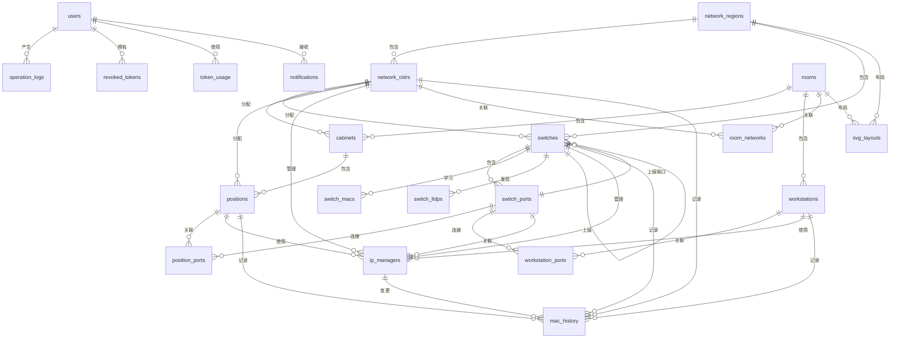
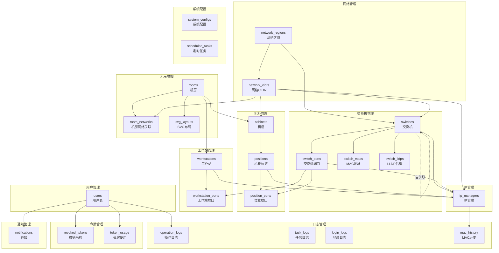
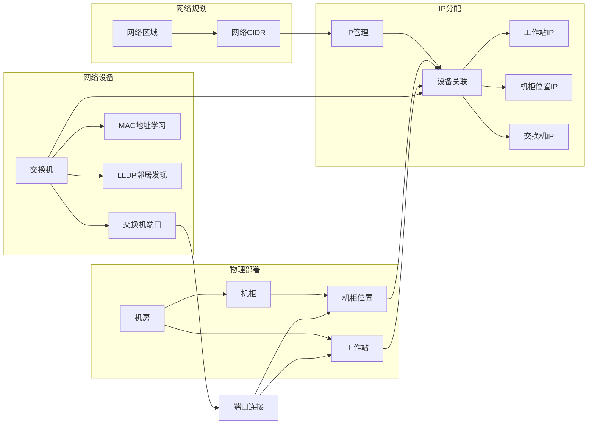

# IPMA 数据库结构文档

**版本：** 1.0.0  
**生成日期：** 2026-04-13  
**数据库类型：** PostgreSQL  

---

## 目录

1. [概述](#概述)
2. [用户管理模块](#用户管理模块)
3. [网络管理模块](#网络管理模块)
4. [机房管理模块](#机房管理模块)
5. [交换机管理模块](#交换机管理模块)
6. [机柜管理模块](#机柜管理模块)
7. [工作站管理模块](#工作站管理模块)
8. [IP管理模块](#ip管理模块)
9. [日志管理模块](#日志管理模块)
10. [令牌管理模块](#令牌管理模块)
11. [通知管理模块](#通知管理模块)
12. [系统配置模块](#系统配置模块)
13. [数据库关系图](#数据库关系图)

---

## 概述

IPMA系统共包含 **25张数据表**，分为以下主要模块：

- 用户管理（1张表）
- 网络管理（2张表）
- 机房管理（3张表）
- 交换机管理（4张表）
- 机柜管理（3张表）
- 工作站管理（2张表）
- IP管理（1张表）
- 日志管理（4张表）
- 令牌管理（2张表）
- 通知管理（1张表）
- 系统配置（2张表）

---

## 用户管理模块

### 1. users（用户表）

存储系统用户信息，包括认证、授权和个人信息。

| 字段名 | 数据类型 | 约束 | 默认值 | 说明 |
|--------|----------|------|--------|------|
| id | UUID | PRIMARY KEY | uuid_generate_v4() | 用户唯一标识 |
| username | VARCHAR(50) | UNIQUE, NOT NULL | - | 用户名 |
| password_hash | VARCHAR(255) | NOT NULL | - | 密码哈希值 |
| email | VARCHAR(100) | UNIQUE, NOT NULL | - | 电子邮箱 |
| role | VARCHAR(20) | NOT NULL | - | 用户角色 |
| status | BOOLEAN | NOT NULL | TRUE | 用户状态（启用/禁用） |
| reset_token | VARCHAR(255) | - | - | 密码重置令牌 |
| reset_token_expiry | TIMESTAMP WITH TIME ZONE | - | - | 重置令牌过期时间 |
| two_factor_secret | VARCHAR(255) | - | - | 双因素认证密钥 |
| two_factor_enabled | BOOLEAN | NOT NULL | FALSE | 是否启用双因素认证 |
| two_factor_verified | BOOLEAN | NOT NULL | FALSE | 双因素认证是否已验证 |
| two_factor_email_code | VARCHAR(10) | - | - | 双因素邮箱验证码 |
| two_factor_email_code_expiry | TIMESTAMP WITH TIME ZONE | - | - | 邮箱验证码过期时间 |
| created_at | TIMESTAMP WITH TIME ZONE | NOT NULL | NOW() | 创建时间 |
| updated_at | TIMESTAMP WITH TIME ZONE | NOT NULL | NOW() | 更新时间 |

**索引：**
- idx_users_username (username)
- idx_users_email (email)

---

## 网络管理模块

### 2. network_regions（网络区域表）

定义网络区域划分，如办公区、数据中心等。

| 字段名 | 数据类型 | 约束 | 默认值 | 说明 |
|--------|----------|------|--------|------|
| id | UUID | PRIMARY KEY | uuid_generate_v4() | 区域唯一标识 |
| name | VARCHAR(20) | UNIQUE, NOT NULL | - | 区域名称 |
| description | TEXT | - | - | 区域描述 |
| created_at | TIMESTAMP WITH TIME ZONE | NOT NULL | NOW() | 创建时间 |
| updated_at | TIMESTAMP WITH TIME ZONE | NOT NULL | NOW() | 更新时间 |

---

### 3. network_cidrs（网络CIDR表）

定义网络CIDR块及其配置信息。

| 字段名 | 数据类型 | 约束 | 默认值 | 说明 |
|--------|----------|------|--------|------|
| id | UUID | PRIMARY KEY | uuid_generate_v4() | CIDR唯一标识 |
| name | VARCHAR(50) | NOT NULL | - | 网络名称 |
| network_region_id | UUID | NOT NULL, REFERENCES network_regions(id) | - | 所属网络区域 |
| ipv4_cidr | CIDR | - | - | IPv4 CIDR地址块 |
| ipv6_cidr | CIDR | - | - | IPv6 CIDR地址块 |
| ipv4_gateway | INET | - | - | IPv4网关地址 |
| ipv6_gateway | INET | - | - | IPv6网关地址 |
| ipv4_dns | INET[] | - | - | IPv4 DNS服务器数组 |
| ipv6_dns | INET[] | - | - | IPv6 DNS服务器数组 |
| description | TEXT | - | - | 网络描述 |
| created_at | TIMESTAMP WITH TIME ZONE | NOT NULL | NOW() | 创建时间 |
| updated_at | TIMESTAMP WITH TIME ZONE | NOT NULL | NOW() | 更新时间 |

**外键关系：**
- network_region_id → network_regions(id)

---

## 机房管理模块

### 4. rooms（机房表）

定义物理机房和办公区域。

| 字段名 | 数据类型 | 约束 | 默认值 | 说明 |
|--------|----------|------|--------|------|
| id | UUID | PRIMARY KEY | uuid_generate_v4() | 机房唯一标识 |
| name | VARCHAR(50) | NOT NULL | - | 机房名称 |
| room_type | VARCHAR(20) | NOT NULL, CHECK | 'OFFICE' | 机房类型（OFFICE/DATA_CENTER） |
| description | TEXT | - | - | 机房描述 |
| created_at | TIMESTAMP WITH TIME ZONE | NOT NULL | NOW() | 创建时间 |
| updated_at | TIMESTAMP WITH TIME ZONE | NOT NULL | NOW() | 更新时间 |

**约束检查：**
- room_type 必须为 'OFFICE' 或 'DATA_CENTER'

---

### 5. room_networks（机房网络关联表）

关联机房与网络的对应关系。

| 字段名 | 数据类型 | 约束 | 默认值 | 说明 |
|--------|----------|------|--------|------|
| id | UUID | PRIMARY KEY | uuid_generate_v4() | 关联唯一标识 |
| room_id | UUID | NOT NULL, REFERENCES rooms(id) ON DELETE CASCADE | - | 机房ID |
| network_id | UUID | NOT NULL, REFERENCES network_cidrs(id) | - | 网络ID |
| created_at | TIMESTAMP WITH TIME ZONE | NOT NULL | NOW() | 创建时间 |
| updated_at | TIMESTAMP WITH TIME ZONE | NOT NULL | NOW() | 更新时间 |

**唯一约束：**
- UNIQUE(room_id, network_id)

**外键关系：**
- room_id → rooms(id) ON DELETE CASCADE
- network_id → network_cidrs(id)

---

### 6. svg_layouts（SVG布局表）

存储可视化布局信息。

| 字段名 | 数据类型 | 约束 | 默认值 | 说明 |
|--------|----------|------|--------|------|
| id | UUID | PRIMARY KEY | uuid_generate_v4() | 布局唯一标识 |
| layout_type | VARCHAR(20) | NOT NULL | - | 布局类型 |
| room_id | UUID | REFERENCES rooms(id) ON DELETE CASCADE | - | 机房ID（可选） |
| network_region_id | UUID | REFERENCES network_regions(id) ON DELETE CASCADE | - | 网络区域ID（可选） |
| element_id | UUID | NOT NULL | - | 元素ID |
| element_type | VARCHAR(20) | NOT NULL | - | 元素类型 |
| x | INTEGER | NOT NULL | 0 | X坐标 |
| y | INTEGER | NOT NULL | 0 | Y坐标 |
| width | INTEGER | NOT NULL | 160 | 宽度 |
| height | INTEGER | NOT NULL | 160 | 高度 |
| rotation | INTEGER | NOT NULL | 0 | 旋转角度 |
| created_at | TIMESTAMP WITH TIME ZONE | NOT NULL | NOW() | 创建时间 |
| updated_at | TIMESTAMP WITH TIME ZONE | NOT NULL | NOW() | 更新时间 |

**唯一约束：**
- UNIQUE NULLS NOT DISTINCT(layout_type, room_id, network_region_id, element_id)

**外键关系：**
- room_id → rooms(id) ON DELETE CASCADE
- network_region_id → network_regions(id) ON DELETE CASCADE

---

## 交换机管理模块

### 7. switches（交换机表）

存储交换机设备信息及其SNMP配置。

| 字段名 | 数据类型 | 约束 | 默认值 | 说明 |
|--------|----------|------|--------|------|
| id | UUID | PRIMARY KEY | uuid_generate_v4() | 交换机唯一标识 |
| name | VARCHAR(100) | NOT NULL | - | 交换机名称 |
| network_region_id | UUID | NOT NULL, REFERENCES network_regions(id) | - | 所属网络区域 |
| network_id | UUID | NOT NULL, REFERENCES network_cidrs(id) | - | 所属网络 |
| model | VARCHAR(100) | - | - | 设备型号 |
| vendor | VARCHAR(50) | - | - | 设备厂商 |
| location | VARCHAR(100) | - | - | 物理位置 |
| snmp_version | VARCHAR(3) | - | 'v2c' | SNMP版本 |
| snmp_community | VARCHAR(64) | - | - | SNMP团体字（v2c） |
| snmp_username | VARCHAR(22) | - | - | SNMP用户名（v3） |
| snmp_auth_protocol | VARCHAR(10) | - | - | SNMP认证协议 |
| snmp_auth_password | VARCHAR(100) | - | - | SNMP认证密码 |
| snmp_priv_protocol | VARCHAR(10) | - | - | SNMP加密协议 |
| snmp_priv_password | VARCHAR(100) | - | - | SNMP加密密码 |
| snmp_port | INTEGER | - | 161 | SNMP端口 |
| parent_switch_id | UUID | REFERENCES switches(id) ON DELETE SET NULL | - | 上级交换机ID |
| parent_port_id | UUID | REFERENCES switch_ports(id) ON DELETE SET NULL | - | 上级端口ID |
| description | TEXT | - | - | 设备描述 |
| created_at | TIMESTAMP WITH TIME ZONE | NOT NULL | NOW() | 创建时间 |
| updated_at | TIMESTAMP WITH TIME ZONE | NOT NULL | NOW() | 更新时间 |

**外键关系：**
- network_region_id → network_regions(id)
- network_id → network_cidrs(id)
- parent_switch_id → switches(id) ON DELETE SET NULL
- parent_port_id → switch_ports(id) ON DELETE SET NULL

**触发器：**
- trg_check_switch_circular_dependency: 防止交换机层级关系出现循环依赖

---

### 8. switch_ports（交换机端口表）

存储交换机端口信息。

| 字段名 | 数据类型 | 约束 | 默认值 | 说明 |
|--------|----------|------|--------|------|
| id | UUID | PRIMARY KEY | uuid_generate_v4() | 端口唯一标识 |
| switch_id | UUID | NOT NULL, REFERENCES switches(id) ON DELETE CASCADE | - | 所属交换机 |
| port_number | VARCHAR(30) | NOT NULL | - | 端口号 |
| port_name | VARCHAR(50) | - | - | 端口名称 |
| port_type | VARCHAR(20) | - | 'access' | 端口类型（access/trunk） |
| vlan_id | INTEGER | - | - | VLAN ID |
| status | VARCHAR(20) | - | 'up' | 端口状态（up/down） |
| speed | VARCHAR(20) | - | - | 端口速率 |
| description | TEXT | - | - | 端口描述 |
| created_at | TIMESTAMP WITH TIME ZONE | NOT NULL | NOW() | 创建时间 |
| updated_at | TIMESTAMP WITH TIME ZONE | NOT NULL | NOW() | 更新时间 |

**唯一约束：**
- UNIQUE(switch_id, port_number)

**外键关系：**
- switch_id → switches(id) ON DELETE CASCADE

---

### 9. switch_macs（交换机MAC地址表）

存储交换机学习到的MAC地址信息。

| 字段名 | 数据类型 | 约束 | 默认值 | 说明 |
|--------|----------|------|--------|------|
| id | UUID | PRIMARY KEY | uuid_generate_v4() | 记录唯一标识 |
| switch_id | UUID | NOT NULL, REFERENCES switches(id) ON DELETE CASCADE | - | 所属交换机 |
| ip_address | VARCHAR(45) | NOT NULL | - | IP地址 |
| mac_address | VARCHAR(20) | NOT NULL | - | MAC地址 |
| interface | VARCHAR(50) | - | - | 接口名称 |
| vlan_id | INTEGER | - | - | VLAN ID |
| created_at | TIMESTAMP WITH TIME ZONE | NOT NULL | NOW() | 创建时间 |
| updated_at | TIMESTAMP WITH TIME ZONE | NOT NULL | NOW() | 更新时间 |

**唯一约束：**
- UNIQUE(switch_id, ip_address)

**外键关系：**
- switch_id → switches(id) ON DELETE CASCADE

---

### 10. switch_lldps（交换机LLDP表）

存储LLDP邻居发现信息。

| 字段名 | 数据类型 | 约束 | 默认值 | 说明 |
|--------|----------|------|--------|------|
| id | UUID | PRIMARY KEY | uuid_generate_v4() | 记录唯一标识 |
| switch_id | UUID | NOT NULL, REFERENCES switches(id) ON DELETE CASCADE | - | 所属交换机 |
| local_port | VARCHAR(50) | NOT NULL | - | 本地端口 |
| neighbor_chassis_id | VARCHAR(100) | - | - | 邻居设备机架ID |
| neighbor_port_id | VARCHAR(100) | - | - | 邻居端口ID |
| neighbor_port_desc | VARCHAR(255) | - | - | 邻居端口描述 |
| neighbor_sys_name | VARCHAR(255) | - | - | 邻居系统名称 |
| neighbor_sys_desc | TEXT | - | - | 邻居系统描述 |
| created_at | TIMESTAMP WITH TIME ZONE | NOT NULL | NOW() | 创建时间 |
| updated_at | TIMESTAMP WITH TIME ZONE | NOT NULL | NOW() | 更新时间 |

**唯一约束：**
- UNIQUE(switch_id, local_port)

**外键关系：**
- switch_id → switches(id) ON DELETE CASCADE

---

## 机柜管理模块

### 11. cabinets（机柜表）

存储机柜设备信息。

| 字段名 | 数据类型 | 约束 | 默认值 | 说明 |
|--------|----------|------|--------|------|
| id | UUID | PRIMARY KEY | uuid_generate_v4() | 机柜唯一标识 |
| name | VARCHAR(50) | NOT NULL | - | 机柜名称 |
| room_id | UUID | REFERENCES rooms(id) ON DELETE SET NULL | - | 所属机房 |
| capacity | INTEGER | NOT NULL | 42 | 机柜容量（U） |
| network_id | UUID | REFERENCES network_cidrs(id) | - | 所属网络 |
| description | TEXT | - | - | 机柜描述 |
| created_at | TIMESTAMP WITH TIME ZONE | NOT NULL | NOW() | 创建时间 |
| updated_at | TIMESTAMP WITH TIME ZONE | NOT NULL | NOW() | 更新时间 |

**外键关系：**
- room_id → rooms(id) ON DELETE SET NULL
- network_id → network_cidrs(id)

---

### 12. positions（机柜位置表）

存储机柜内的位置信息。

| 字段名 | 数据类型 | 约束 | 默认值 | 说明 |
|--------|----------|------|--------|------|
| id | UUID | PRIMARY KEY | uuid_generate_v4() | 位置唯一标识 |
| name | VARCHAR(50) | NOT NULL | - | 位置名称 |
| cabinet_id | UUID | NOT NULL, REFERENCES cabinets(id) ON DELETE CASCADE | - | 所属机柜 |
| start_u | INTEGER | NOT NULL | 1 | 起始U位 |
| end_u | INTEGER | NOT NULL | 1 | 结束U位 |
| network_id | UUID | REFERENCES network_cidrs(id) | - | 所属网络 |
| description | TEXT | - | - | 位置描述 |
| created_at | TIMESTAMP WITH TIME ZONE | NOT NULL | NOW() | 创建时间 |
| updated_at | TIMESTAMP WITH TIME ZONE | NOT NULL | NOW() | 更新时间 |

**外键关系：**
- cabinet_id → cabinets(id) ON DELETE CASCADE
- network_id → network_cidrs(id)

---

### 13. position_ports（位置端口关联表）

关联机柜位置与交换机端口。

| 字段名 | 数据类型 | 约束 | 默认值 | 说明 |
|--------|----------|------|--------|------|
| id | UUID | PRIMARY KEY | uuid_generate_v4() | 关联唯一标识 |
| position_id | UUID | NOT NULL, REFERENCES positions(id) ON DELETE CASCADE | - | 位置ID |
| switch_port_id | UUID | NOT NULL, REFERENCES switch_ports(id) ON DELETE CASCADE | - | 交换机端口ID |
| created_at | TIMESTAMP WITH TIME ZONE | NOT NULL | NOW() | 创建时间 |
| updated_at | TIMESTAMP WITH TIME ZONE | NOT NULL | NOW() | 更新时间 |

**唯一约束：**
- UNIQUE(position_id, switch_port_id)

**外键关系：**
- position_id → positions(id) ON DELETE CASCADE
- switch_port_id → switch_ports(id) ON DELETE CASCADE

---

## 工作站管理模块

### 14. workstations（工作站表）

存储工作站设备信息。

| 字段名 | 数据类型 | 约束 | 默认值 | 说明 |
|--------|----------|------|--------|------|
| id | UUID | PRIMARY KEY | uuid_generate_v4() | 工作站唯一标识 |
| name | VARCHAR(50) | NOT NULL | - | 工作站名称 |
| room_id | UUID | NOT NULL, REFERENCES rooms(id) | - | 所属机房 |
| manager | VARCHAR(50) | - | - | 管理员 |
| description | TEXT | - | - | 工作站描述 |
| created_at | TIMESTAMP WITH TIME ZONE | NOT NULL | NOW() | 创建时间 |
| updated_at | TIMESTAMP WITH TIME ZONE | NOT NULL | NOW() | 更新时间 |

**外键关系：**
- room_id → rooms(id)

---

### 15. workstation_ports（工作站端口关联表）

关联工作站与交换机端口。

| 字段名 | 数据类型 | 约束 | 默认值 | 说明 |
|--------|----------|------|--------|------|
| id | UUID | PRIMARY KEY | uuid_generate_v4() | 关联唯一标识 |
| workstation_id | UUID | NOT NULL, REFERENCES workstations(id) ON DELETE CASCADE | - | 工作站ID |
| switch_port_id | UUID | NOT NULL, REFERENCES switch_ports(id) ON DELETE CASCADE | - | 交换机端口ID |
| created_at | TIMESTAMP WITH TIME ZONE | NOT NULL | NOW() | 创建时间 |
| updated_at | TIMESTAMP WITH TIME ZONE | NOT NULL | NOW() | 更新时间 |

**唯一约束：**
- UNIQUE(workstation_id, switch_port_id)

**外键关系：**
- workstation_id → workstations(id) ON DELETE CASCADE
- switch_port_id → switch_ports(id) ON DELETE CASCADE

---

## IP管理模块

### 16. ip_managers（IP管理表）

核心表，统一管理所有IP地址分配和设备关联。

| 字段名 | 数据类型 | 约束 | 默认值 | 说明 |
|--------|----------|------|--------|------|
| id | UUID | PRIMARY KEY | uuid_generate_v4() | IP记录唯一标识 |
| workstation_id | UUID | REFERENCES workstations(id) ON DELETE SET NULL | - | 工作站ID（可选） |
| position_id | UUID | REFERENCES positions(id) ON DELETE SET NULL | - | 机柜位置ID（可选） |
| switch_id | UUID | REFERENCES switches(id) ON DELETE SET NULL | - | 交换机ID（可选） |
| switch_port_id | UUID | REFERENCES switch_ports(id) ON DELETE SET NULL | - | 交换机端口ID（可选） |
| device_type | VARCHAR(20) | NOT NULL, CHECK | - | 设备类型（workstation/cabinet_position/switch/unknown） |
| network_id | UUID | NOT NULL, REFERENCES network_cidrs(id) | - | 所属网络 |
| ip_address | INET | NOT NULL | - | IP地址 |
| ip_version | SMALLINT | NOT NULL | 4 | IP版本（4/6） |
| mac_address | VARCHAR(20) | - | - | MAC地址 |
| hostname | VARCHAR(100) | - | - | 主机名 |
| status | VARCHAR(20) | NOT NULL | 'active' | 状态（active/inactive） |
| last_seen | TIMESTAMP WITH TIME ZONE | NOT NULL | NOW() | 最后在线时间 |
| created_at | TIMESTAMP WITH TIME ZONE | NOT NULL | NOW() | 创建时间 |
| updated_at | TIMESTAMP WITH TIME ZONE | NOT NULL | NOW() | 更新时间 |

**约束检查：**
- device_type 必须为 'workstation', 'cabinet_position', 'switch', 'unknown' 之一
- 设备一致性约束：确保设备类型与关联ID匹配

**索引：**
- idx_ip_managers_workstation_id (workstation_id)
- idx_ip_managers_switch_id (switch_id) WHERE device_type = 'switch'
- idx_ip_managers_ip_address (ip_address)
- idx_ip_managers_mac_address (mac_address)

**外键关系：**
- workstation_id → workstations(id) ON DELETE SET NULL
- position_id → positions(id) ON DELETE SET NULL
- switch_id → switches(id) ON DELETE SET NULL
- switch_port_id → switch_ports(id) ON DELETE SET NULL
- network_id → network_cidrs(id)

**触发器：**
- trg_log_mac_address_change: 记录MAC地址变更历史

---

## 日志管理模块

### 17. operation_logs（操作日志表）

记录用户操作日志。

| 字段名 | 数据类型 | 约束 | 默认值 | 说明 |
|--------|----------|------|--------|------|
| id | UUID | PRIMARY KEY | uuid_generate_v4() | 日志唯一标识 |
| user_id | UUID | NOT NULL, REFERENCES users(id) | - | 操作用户ID |
| action | VARCHAR(100) | NOT NULL | - | 操作动作 |
| resource_type | VARCHAR(50) | NOT NULL | - | 资源类型 |
| resource_id | UUID | NOT NULL | - | 资源ID |
| details | JSONB | NOT NULL | '{}' | 操作详情 |
| result | BOOLEAN | NOT NULL | - | 操作结果 |
| ip_address | VARCHAR(50) | NOT NULL | - | 操作IP地址 |
| created_at | TIMESTAMP WITH TIME ZONE | NOT NULL | NOW() | 创建时间 |

**索引：**
- idx_operation_logs_user_id (user_id)
- idx_operation_logs_created_at (created_at)

**外键关系：**
- user_id → users(id)

---

### 18. task_logs（任务日志表）

记录后台任务执行日志。

| 字段名 | 数据类型 | 约束 | 默认值 | 说明 |
|--------|----------|------|--------|------|
| id | UUID | PRIMARY KEY | uuid_generate_v4() | 日志唯一标识 |
| task_name | VARCHAR(100) | NOT NULL | - | 任务名称 |
| status | VARCHAR(20) | NOT NULL | - | 任务状态 |
| details | JSONB | NOT NULL | '{}' | 任务详情 |
| start_time | TIMESTAMP WITH TIME ZONE | NOT NULL | NOW() | 开始时间 |
| end_time | TIMESTAMP WITH TIME ZONE | - | - | 结束时间 |
| duration | INTEGER | - | - | 执行时长（秒） |

---

### 19. login_logs（登录日志表）

记录用户登录日志。

| 字段名 | 数据类型 | 约束 | 默认值 | 说明 |
|--------|----------|------|--------|------|
| id | UUID | PRIMARY KEY | uuid_generate_v4() | 日志唯一标识 |
| username | VARCHAR(50) | NOT NULL | - | 登录用户名 |
| ip_address | VARCHAR(50) | NOT NULL | - | 登录IP地址 |
| user_agent | VARCHAR(255) | - | - | 用户代理 |
| success | BOOLEAN | NOT NULL | - | 是否成功 |
| error_message | VARCHAR(255) | - | - | 错误信息 |
| created_at | TIMESTAMP WITH TIME ZONE | NOT NULL | NOW() | 创建时间 |

**索引：**
- idx_login_logs_username (username)
- idx_login_logs_created_at (created_at)

---

### 20. mac_history（MAC地址历史表）

记录MAC地址变更历史。

| 字段名 | 数据类型 | 约束 | 默认值 | 说明 |
|--------|----------|------|--------|------|
| id | UUID | PRIMARY KEY | uuid_generate_v4() | 记录唯一标识 |
| mac_address | VARCHAR(20) | NOT NULL | - | MAC地址 |
| ip_address | INET | NOT NULL | - | IP地址 |
| ip_manager_id | UUID | NOT NULL, REFERENCES ip_managers(id) ON DELETE CASCADE | - | IP管理记录ID |
| device_type | VARCHAR(20) | NOT NULL | - | 设备类型 |
| workstation_id | UUID | REFERENCES workstations(id) ON DELETE SET NULL | - | 工作站ID |
| position_id | UUID | REFERENCES positions(id) ON DELETE SET NULL | - | 机柜位置ID |
| switch_id | UUID | REFERENCES switches(id) ON DELETE SET NULL | - | 交换机ID |
| network_id | UUID | NOT NULL, REFERENCES network_cidrs(id) | - | 网络ID |
| change_type | VARCHAR(20) | NOT NULL | 'update' | 变更类型（create/update） |
| created_at | TIMESTAMP WITH TIME ZONE | NOT NULL | NOW() | 创建时间 |

**索引：**
- idx_mac_history_mac_address (mac_address)
- idx_mac_history_ip_address (ip_address)
- idx_mac_history_ip_manager_id (ip_manager_id)
- idx_mac_history_created_at (created_at)

**外键关系：**
- ip_manager_id → ip_managers(id) ON DELETE CASCADE
- workstation_id → workstations(id) ON DELETE SET NULL
- position_id → positions(id) ON DELETE SET NULL
- switch_id → switches(id) ON DELETE SET NULL
- network_id → network_cidrs(id)

---

## 令牌管理模块

### 21. revoked_tokens（撤销令牌表）

存储已撤销的JWT令牌。

| 字段名 | 数据类型 | 约束 | 默认值 | 说明 |
|--------|----------|------|--------|------|
| id | UUID | PRIMARY KEY | uuid_generate_v4() | 记录唯一标识 |
| token_hash | VARCHAR(255) | NOT NULL | - | 令牌哈希值 |
| user_id | UUID | REFERENCES users(id) | - | 用户ID |
| revoked_at | TIMESTAMP WITH TIME ZONE | NOT NULL | NOW() | 撤销时间 |
| expiry | TIMESTAMP WITH TIME ZONE | NOT NULL | - | 令牌过期时间 |

**索引：**
- idx_revoked_tokens_token_hash (token_hash)

**外键关系：**
- user_id → users(id)

---

### 22. token_usage（令牌使用表）

记录令牌使用情况。

| 字段名 | 数据类型 | 约束 | 默认值 | 说明 |
|--------|----------|------|--------|------|
| id | UUID | PRIMARY KEY | uuid_generate_v4() | 记录唯一标识 |
| token_hash | VARCHAR(255) | NOT NULL | - | 令牌哈希值 |
| user_id | UUID | REFERENCES users(id) | - | 用户ID |
| ip_address | VARCHAR(50) | NOT NULL | - | 请求IP地址 |
| user_agent | VARCHAR(255) | - | - | 用户代理 |
| request_path | VARCHAR(255) | NOT NULL | - | 请求路径 |
| created_at | TIMESTAMP WITH TIME ZONE | NOT NULL | NOW() | 创建时间 |

**外键关系：**
- user_id → users(id)

---

## 通知管理模块

### 23. notifications（通知表）

存储用户通知消息。

| 字段名 | 数据类型 | 约束 | 默认值 | 说明 |
|--------|----------|------|--------|------|
| id | UUID | PRIMARY KEY | uuid_generate_v4() | 通知唯一标识 |
| user_id | UUID | REFERENCES users(id) | - | 接收用户ID |
| title | VARCHAR(100) | NOT NULL | - | 通知标题 |
| content | TEXT | NOT NULL | - | 通知内容 |
| notification_type | VARCHAR(20) | NOT NULL | - | 通知类型 |
| read | BOOLEAN | NOT NULL | FALSE | 是否已读 |
| created_at | TIMESTAMP WITH TIME ZONE | NOT NULL | NOW() | 创建时间 |

**外键关系：**
- user_id → users(id)

---

## 系统配置模块

### 24. system_configs（系统配置表）

存储系统配置项。

| 字段名 | 数据类型 | 约束 | 默认值 | 说明 |
|--------|----------|------|--------|------|
| id | UUID | PRIMARY KEY | uuid_generate_v4() | 配置唯一标识 |
| config_type | VARCHAR(50) | NOT NULL | - | 配置类型 |
| key | VARCHAR(100) | NOT NULL | - | 配置键 |
| value | TEXT | - | - | 配置值 |
| created_at | TIMESTAMP WITH TIME ZONE | NOT NULL | NOW() | 创建时间 |
| updated_at | TIMESTAMP WITH TIME ZONE | NOT NULL | NOW() | 更新时间 |

**唯一约束：**
- UNIQUE(config_type, key)

---

### 25. scheduled_tasks（定时任务表）

存储定时任务配置。

| 字段名 | 数据类型 | 约束 | 默认值 | 说明 |
|--------|----------|------|--------|------|
| id | UUID | PRIMARY KEY | uuid_generate_v4() | 任务唯一标识 |
| name | VARCHAR(100) | UNIQUE, NOT NULL | - | 任务名称 |
| task_type | VARCHAR(50) | NOT NULL | - | 任务类型 |
| cron_expression | VARCHAR(100) | NOT NULL | - | Cron表达式 |
| enabled | BOOLEAN | NOT NULL | TRUE | 是否启用 |
| config | JSONB | - | '{}' | 任务配置 |
| last_run_at | TIMESTAMP WITH TIME ZONE | - | - | 上次执行时间 |
| next_run_at | TIMESTAMP WITH TIME ZONE | - | - | 下次执行时间 |
| last_result | TEXT | - | - | 上次执行结果 |
| created_at | TIMESTAMP WITH TIME ZONE | NOT NULL | NOW() | 创建时间 |
| updated_at | TIMESTAMP WITH TIME ZONE | NOT NULL | NOW() | 更新时间 |

**索引：**
- idx_scheduled_tasks_name (name)
- idx_scheduled_tasks_enabled (enabled)

---

## 数据库关系图

### Mermaid ER图

### 模块关系流程图

### 核心业务流程图

---

## 数据库特性

### 扩展

- **uuid-ossp**: UUID生成函数
- **pgcrypto**: 加密函数

### 触发器

1. **trg_check_switch_circular_dependency**: 防止交换机层级关系循环依赖
2. **trg_log_mac_address_change**: 自动记录MAC地址变更历史

### 视图

系统创建了多个视图以优化查询性能（具体视图定义详见源代码）。

---

## 统计信息

| 模块 | 表数量 | 主要功能 |
|------|--------|----------|
| 用户管理 | 1 | 用户认证与授权 |
| 网络管理 | 2 | 网络区域与CIDR管理 |
| 机房管理 | 3 | 机房与布局管理 |
| 交换机管理 | 4 | 交换机设备与端口管理 |
| 机柜管理 | 3 | 机柜与位置管理 |
| 工作站管理 | 2 | 工作站设备管理 |
| IP管理 | 1 | IP地址统一管理 |
| 日志管理 | 4 | 操作、任务、登录与MAC历史记录 |
| 令牌管理 | 2 | JWT令牌管理 |
| 通知管理 | 1 | 用户通知系统 |
| 系统配置 | 2 | 系统配置与定时任务 |
| **总计** | **25** | - |

---

**文档结束**
