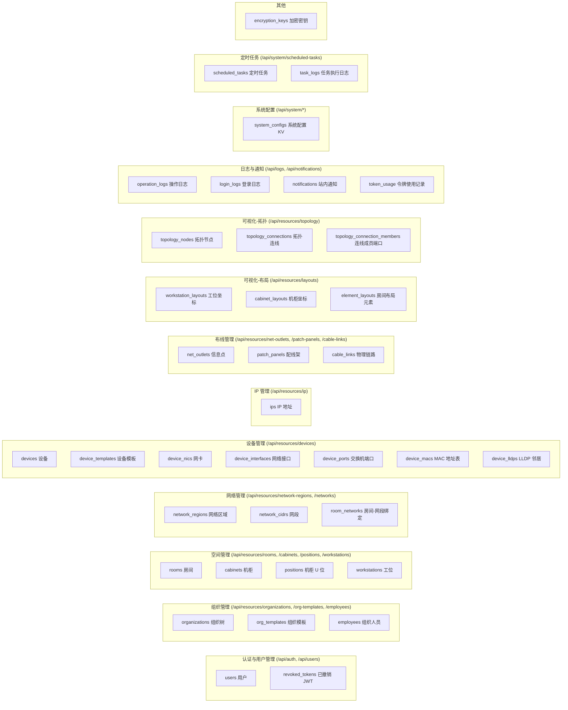

# IPMA 数据库结构示意图

数据来源：`crates/ipma-init/src/schema/tables/`（建表 DDL）与 `src/routes/mod.rs`（路由分组）。
共 **36 张表**、6 个视图、1 个路径查询函数，全部主键为 `id UUID`，绝大多数含 `created_at/updated_at`。

## 一、功能模块 → 数据库表归属



跨模块说明：

- **数据导入导出**（`/api/system/import-export/*`，crates/ipma-data-management）：CSV 导入导出横跨上表 28 张（除
  users、encryption_keys、system_configs、scheduled_tasks、task_logs、operation_logs、login_logs、
  notifications、revoked_tokens 外的全部业务表）；`export/database` 走 pg_dump 全库导出。
- **证书管理**（`/api/system/certificate/*`，crates/ipma-x509-manager）：仅文件系统，不涉及数据库。
- **认证模块**登录时写 `login_logs`；`revoked_tokens`/`token_usage` 由认证写入、定时任务清理。

## 二、全库 ER 图（外键关系）

```mermaid
erDiagram
  %% ===== 组织与空间 =====
  org_templates ||--o{ organizations : "template_id"
  organizations |o--o{ organizations : "parent_id 自引用"
  organizations |o--o{ rooms : "org_id"
  rooms ||--o{ cabinets : "room_id"
  rooms ||--o{ workstations : "room_id"
  rooms ||--o{ net_outlets : "room_id"
  cabinets ||--o{ positions : "cabinet_id"
  cabinets ||--o{ patch_panels : "cabinet_id"

  %% ===== 网络 =====
  network_regions ||--o{ network_cidrs : "network_region_id NOT NULL"
  rooms ||--o{ room_networks : "room_id"
  network_cidrs ||--o{ room_networks : "network_id"

  %% ===== 设备 =====
  device_templates |o--o{ devices : "template_id"
  rooms |o--o{ devices : "room_id"
  workstations |o--o{ devices : "workstation_id SET NULL"
  positions |o--o{ devices : "position_id SET NULL"
  devices ||--o{ device_nics : "device_id"
  devices ||--o{ device_interfaces : "device_id"
  device_nics |o--o{ device_interfaces : "nic_id SET NULL"
  devices ||--o{ device_ports : "device_id"
  devices ||--o{ device_macs : "device_id"
  devices ||--o{ device_lldps : "device_id"

  %% ===== IP =====
  device_interfaces ||--o{ ips : "device_interface_id NOT NULL"
  network_cidrs |o--o{ ips : "network_id"

  %% ===== 布线（多态端点，触发器校验） =====
  device_ports ..o{ cable_links : "a/b_endpoint_id 多态"
  net_outlets ..o{ cable_links : "a/b_endpoint_id 多态"
  device_interfaces ..o{ cable_links : "a/b_endpoint_id 多态"
  patch_panels ..o{ cable_links : "a/b_endpoint_id 多态"

  %% ===== 布局 =====
  workstations ||--o| workstation_layouts : "workstation_id 唯一"
  rooms ||--o{ workstation_layouts : "room_id"
  cabinets ||--o| cabinet_layouts : "cabinet_id 唯一"
  rooms ||--o{ element_layouts : "room_id"

  %% ===== 拓扑 =====
  devices ||--o| topology_nodes : "device_id 唯一"
  devices ||--o{ topology_connections : "source_device_id"
  devices ||--o{ topology_connections : "target_device_id"
  device_ports |o--o{ topology_connections : "source_device_port_id SET NULL"
  device_ports |o--o{ topology_connections : "target_device_port_id SET NULL"
  topology_connections ||--o{ topology_connection_members : "connection_id"
  devices ||--o{ topology_connection_members : "device_id"
  device_ports ||--o{ topology_connection_members : "device_port_id"

  %% ===== 用户 / 日志 / 令牌 =====
  users |o--o{ operation_logs : "user_id SET NULL"
  users ||--o{ revoked_tokens : "user_id"
  users ||--o{ token_usage : "user_id"
  users ||--o{ notifications : "user_id"

  organizations {
    uuid id PK
    text name "同级唯一"
    uuid parent_id FK "自引用 RESTRICT"
    uuid template_id FK "RESTRICT"
    text type_path
    int level_index "触发器维护"
  }
  org_templates {
    uuid id PK
    text name UK
    jsonb levels "层级定义"
    jsonb icons
  }
  rooms {
    uuid id PK
    text name UK
    text room_type "OFFICE/LOBBY/RECEPTION/DATA_CENTER/TELECOM_CLOSET/OTHER"
    uuid org_id FK "RESTRICT"
  }
  cabinets {
    uuid id PK
    text name "room 内唯一"
    uuid room_id FK "RESTRICT"
    int capacity "默认 42U"
  }
  positions {
    uuid id PK
    text name "cabinet 内唯一"
    uuid cabinet_id FK "CASCADE"
    int start_u "触发器防 U 位重叠"
    int end_u
  }
  workstations {
    uuid id PK
    text name "room 内唯一"
    uuid room_id FK "RESTRICT"
    text manager
  }
  network_regions {
    uuid id PK
    text name UK
    cidr_array ipv4_cidrs "区域 CIDR 范围"
    cidr_array ipv6_cidrs
  }
  network_cidrs {
    uuid id PK
    text name "区域内唯一"
    uuid network_region_id FK "NOT NULL"
    cidr ipv4_cidr
    cidr ipv6_cidr
    inet ipv4_gateway
    inet ipv6_gateway
    inet_array ipv4_dns
    inet_array ipv6_dns
  }
  room_networks {
    uuid room_id FK "CASCADE"
    uuid network_id FK
  }
  devices {
    uuid id PK
    text name
    text hostname
    text device_type "9 种枚举"
    uuid room_id FK "RESTRICT"
    uuid workstation_id FK "SET NULL"
    uuid position_id FK "SET NULL"
    uuid template_id FK "SET NULL"
    text snmp_community "SNMP 凭据等 10 列"
  }
  device_templates {
    uuid id PK
    text name UK
    text device_type
  }
  device_nics {
    uuid id PK
    uuid device_id FK "CASCADE"
    text name "device 内唯一"
    text card_type "pcie/onboard/usb/virtual/wwan/wifi"
  }
  device_interfaces {
    uuid id PK
    uuid device_id FK "CASCADE"
    uuid nic_id FK "SET NULL"
    text name "device 内唯一"
    text physical_type "rj45/sfp/virtual 等"
    text interface_role "management/business/loopback/uplink"
    macaddr mac_address
    int vlan_id
  }
  device_ports {
    uuid id PK
    uuid device_id FK "CASCADE"
    int port_number "device 内唯一"
    text port_type "access/trunk/uplink/stack/console"
    int vlan_id
    text status
  }
  device_macs {
    uuid id PK
    uuid device_id FK "CASCADE"
    inet ip_address "device+ip 唯一"
    macaddr mac_address
  }
  device_lldps {
    uuid id PK
    uuid device_id FK "CASCADE"
    text local_port "device 内唯一"
    text neighbor_chassis_id
  }
  ips {
    uuid id PK
    inet ip_address UK
    uuid device_interface_id FK "NOT NULL CASCADE"
    uuid network_id FK "可空"
    text ip_version
    text status
  }
  net_outlets {
    uuid id PK
    text name "全局唯一"
    uuid room_id FK "RESTRICT"
  }
  patch_panels {
    uuid id PK
    text name "cabinet 内唯一"
    uuid cabinet_id FK "CASCADE"
  }
  cable_links {
    uuid id PK
    text a_endpoint_type "device_port/net_outlet/device_interface/patch_panel"
    uuid a_endpoint_id "多态，触发器校验"
    text b_endpoint_type
    uuid b_endpoint_id
    text link_type "ethernet/fiber/console"
    text cable_label
    numeric length_m
    bool tested
  }
  workstation_layouts {
    uuid id PK
    uuid workstation_id FK "CASCADE 唯一"
    uuid room_id FK "CASCADE"
    int x
    int y
    int rotation
  }
  cabinet_layouts {
    uuid id PK
    uuid cabinet_id FK "CASCADE 唯一"
    int x
    int y
    int rotation
  }
  element_layouts {
    uuid id PK
    uuid room_id FK "CASCADE"
    text element_type "room+type 唯一，门/墙等"
    int x
    int y
    int rotation
  }
  topology_nodes {
    uuid id PK
    uuid device_id FK "CASCADE 唯一"
    int x
    int y
    int width
    int height
  }
  topology_connections {
    uuid id PK
    uuid source_device_id FK "CASCADE"
    uuid target_device_id FK "CASCADE"
    uuid source_device_port_id FK "SET NULL"
    uuid target_device_port_id FK "SET NULL"
    text connection_type "physical/logical"
    bool auto_discovered
  }
  topology_connection_members {
    uuid id PK
    uuid connection_id FK "CASCADE"
    uuid device_id FK "CASCADE"
    uuid device_port_id FK "CASCADE"
    text side "source/target"
  }
  users {
    uuid id PK
    text username UK
    text email UK
    text password_hash
    text role
    text two_factor_cols "2FA 相关 6 列"
  }
  operation_logs {
    uuid id PK
    uuid user_id FK "SET NULL"
    text action
    text resource_type
    jsonb details
  }
  login_logs {
    uuid id PK
    text username
    bool success
    text ip_address
  }
  notifications {
    uuid id PK
    uuid user_id FK "CASCADE"
    text notification_type
    bool read
  }
  revoked_tokens {
    uuid id PK
    uuid user_id FK "CASCADE"
    text token_hash
  }
  token_usage {
    uuid id PK
    uuid user_id FK "CASCADE"
    text token_hash
    text request_path
  }
  system_configs {
    uuid id PK
    text config_type "UNIQUE(config_type,key)"
    text key
    text value
  }
  scheduled_tasks {
    uuid id PK
    text name UK
    text task_type
    text cron_expression
    bool enabled
    jsonb config
  }
  task_logs {
    uuid id PK
    text task_name
    text status
    timestamptz start_time
    timestamptz end_time
  }
  encryption_keys {
    uuid id PK
    text key_name UK
    text encryption_key
  }
```

图中 `..o{（虚线）` 表示 `cable_links` 的**多态逻辑外键**：`a/b_endpoint_id` 按
`a/b_endpoint_type` 指向 `device_ports` / `net_outlets` / `device_interfaces` /
`patch_panels` 四表之一，无真实 FK 约束，由触发器 `validate_cable_link_endpoints`
校验存在性，并由反向触发器阻止被引用端点删除。`|o--` 表示可空外键，`||--` 表示
非空外键，`||--o|` 表示一对一（UNIQUE）。

## 三、模块-表归属明细

| 功能模块 | 路由前缀 | 处理代码 | 管理的表 |
| --- | --- | --- | --- |
| 认证与用户 | `/api/auth/*`、`/api/users` | `src/auth/` | users、login_logs（登录写入）、revoked_tokens |
| 组织管理 | `/api/resources/organizations`、`/org-templates`、`/employees` | `src/resource/organization.rs`、`org_template.rs`、`employee.rs` | organizations、org_templates、employees |
| 空间管理 | `/api/resources/rooms`、`/cabinets`、`/positions`、`/workstations` | `src/resource/room.rs`、`cabinets.rs`、`position.rs`、`workstation.rs` | rooms、cabinets、positions、workstations、room_networks（房间侧同步） |
| 网络管理 | `/api/resources/network-regions`、`/networks` | `src/resource/network.rs` | network_regions、network_cidrs、room_networks |
| IP 管理 | `/api/resources/ip` | `src/resource/ip.rs` | ips（查询 device_interfaces、room_networks） |
| 设备管理 | `/api/resources/devices` | `src/resource/device/` | devices、device_templates、device_nics、device_interfaces、device_ports、device_macs、device_lldps、ips（自动分配） |
| 布线管理 | `/api/resources/net-outlets`、`/patch-panels`、`/cable-links` | `src/resource/net_outlet.rs`、`patch_panel.rs`、`cable_link.rs` | net_outlets、patch_panels、cable_links |
| 可视化-布局 | `/api/resources/layouts` | `crates/ipma-visualization/layout.rs` | workstation_layouts、cabinet_layouts、element_layouts |
| 可视化-拓扑 | `/api/resources/topology` | `crates/ipma-visualization/topology.rs` | topology_nodes、topology_connections、topology_connection_members（物理连线由 cable_links 派生） |
| 日志与通知 | `/api/logs/*`、`/api/notifications` | `src/log/` | operation_logs、login_logs、notifications |
| 系统配置 | `/api/system/*` | `src/system/` | system_configs（证书模块除外，不涉及库） |
| 定时任务 | `/api/system/scheduled-tasks` | `crates/ipma-scheduler` | scheduled_tasks、task_logs（另清理 revoked_tokens、token_usage） |
| 数据导入导出 | `/api/system/import-export/*` | `crates/ipma-data-management` | 28 张业务表（见上文 CSV 清单） |

## 四、视图与函数（非实体）

- 视图：`ip_with_details`、`devices_with_details`、`net_outlets_with_details`、
  `patch_panels_with_details`、`cable_links_with_details`（列表联查）、
  `mac_comparison`（SNMP 采集 MAC 与管理 MAC 比对）。
- 函数：`find_cable_path(from_type, from_id, to_type, to_id)` 递归查询两点间物理链路路径。
